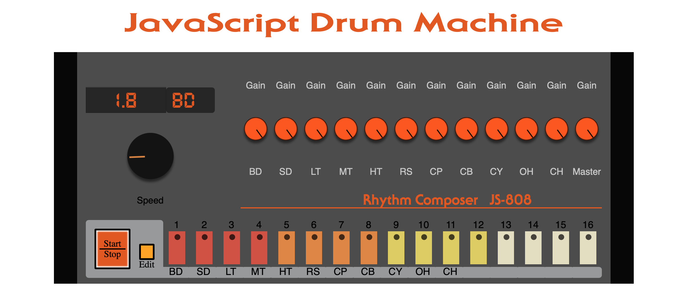

[JS Drum Machine](http://javascript-drum-machine.herokuapp.com/)
=================

JSDrumMachine is an interactive drum machine based on the Roland TR-808 originally released in 1980. All sounds are sourced from the original machine. 

## Table of Contents
  * [Technologies](#technologies)

### Technologies
  * JavaScript
  * Node.js
  * Express.js
  * Webpack
  
